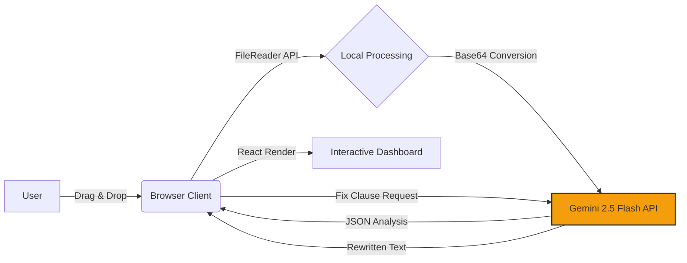

# contract-audit

# ⚖️ Fine Print Breaker

**AI-Powered Contract Risk Auditor & Solver**

> *Built with "Vibe Coding" in Google AI Studio.*

Fine Print Breaker is a client-side web application designed to protect freelancers, tenants, and employees from predatory legal agreements. Unlike standard analyzers, **it doesn't just find the problems—it fixes them.**

It uses **Google's Gemini 2.5 Flash** model to audit contracts, identify hidden traps, and **rewrite unfair clauses** into standard, mutual legal language instantly.

## 🚀 Live Demo
[https://alenjofi.github.io/contract-audit/](https://alenjofi.github.io/contract-audit/)

## ✨ Key Features

* **🔍 Instant Risk Audit:** Drag and drop **PDF, DOCX, TXT, or MD** files (up to 10MB) for a 20-point legal safety check.
* **✨ AI Clause Rewriter:** Found a predatory clause? Click **"Fix Clause"** to have the AI legally redraft it to be fair and mutual.
* **🖨️ Professional PDF Export:** One-click download of the full audit report, stripped of UI elements, ready to email to a lawyer or client.
* **🎯 Context-Aware Analysis:** Tailored logic for **Freelance, Employment, Lease, and NDA** contracts.
* **🛡️ 100% Privacy Focused:** The app runs entirely in the browser. Files are processed transiently in memory and are **never stored** on any server.

## 🛠️ Tech Stack

This project is architected as a **Single File Application (SFA)** for maximum portability and security.

* **Frontend:** React 18 (via CDN)
* **Styling:** Tailwind CSS (via CDN) + Custom Animations
* **AI Model:** Google Gemini 2.5 Flash (via `@google/genai` SDK)
* **Engine:** Browser Native `FileReader` & `window.print()` API
* **Icons:** Lucide-React SVG components

## 🧠 System Architecture



## ⚡ Quick Start

Since this is a static site, you don't need `npm install` or a build process.

1.  **Clone the repo:**
    ```bash
    git clone [https://github.com/alenjofi/contract-audit.git](https://github.com/alenjofi/contract-audit.git)
    ```
2.  **Open `index.html`** in any modern web browser.
3.  **That's it!** The app will load immediately.

> **Note:** To run this locally or fork it, you will need your own Google Gemini API Key. Replace the `GOOGLE_API_KEY` variable inside the `<script>` tag in `index.html`.

## 👨‍💻 Developer's Note
This project demonstrates **AI-Assisted Rapid Prototyping**. 
Instead of traditional manual coding, I utilized **Google Gemini** as a technical co-pilot to architect, debug, and deploy a secure, serverless React application in under 24 hours. 

**Focus Areas:**
* Prompt Engineering & Logic Flow
* API Security (Referrer Restrictions)
* User Experience (UX) Design

## ⚠️ Legal Disclaimer
**This tool is for informational purposes only.** The AI's analysis does not constitute legal advice. Always consult a qualified attorney before signing binding agreements.

---
*Created by Alen Jofi*
