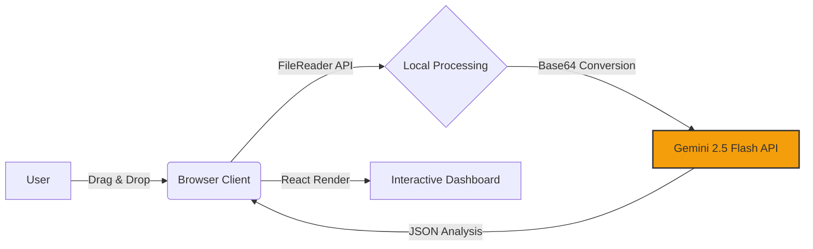

# contract-audit

# ⚖️ Fine Print Breaker

**AI-Powered Contract Risk Auditor**

> *Built with "Vibe Coding" in Google AI Studio.*

Fine Print Breaker is a client-side web application designed to protect freelancers, tenants, and employees from predatory legal agreements. It uses Google's **Gemini 2.5 Flash** model to audit contracts, identifying hidden traps, unfair clauses, and "legalese" that could hurt the signatory.

## 🚀 Live Demo
[https://alenjofi.github.io/contract-audit/](https://alenjofi.github.io/contract-audit/)

## ✨ Key Features

* **📄 Multi-Format Support:** Drag and drop **PDF, DOCX, TXT, or MD** files (up to 10MB).
* **🎯 Context-Aware Analysis:** Select your specific contract type for tailored auditing:
    * **Freelance:** Checks for IP theft, non-competes, and late payment clauses.
    * **Employment:** Reviews termination rights, severance, and benefits.
    * **Lease:** Audits rent escalation, deposit returns, and repair duties.
    * **NDA:** Analyzes confidentiality scope and duration.
* **📊 Risk Scoring System:** Instantly generates a **0-100 Risk Score** (Safe, Caution, or High Risk).
* **👶 ELI5 Explanations:** Translates complex legal jargon into "Explain Like I'm 5" simple English.
* **💬 AI Rebuttal Generator:** Found a bad clause? Click a button to generate a professional, firm negotiation email to push back.
* **🔒 Privacy-Focused:** The app runs entirely in the browser. Files are processed transiently and are not stored on any server.

## 🛠️ Tech Stack

This project works as a **Single File Application**, meaning the entire logic, styling, and UI are contained within `index.html`.

* **Frontend:** React 18 (via CDN)
* **Styling:** Tailwind CSS (via CDN) + Custom Animations
* **AI Model:** Google Gemini 2.5 Flash (via `@google/genai` SDK)
* **File Processing:** Native Browser `FileReader` API (Client-side)
* **Icons:** Lucide-style SVG components

## 🧠 How It Works

1.  **Input:** The user selects a contract category and uploads a document.
2.  **Processing:** The browser converts the file to Base64.
3.  **Analysis:** The file is sent to the Gemini API with a strict system instruction acting as a "Senior Contract Lawyer."
4.  **Structured Output:** The AI returns a JSON object containing the risk score, critical warnings, and summary.
5.  **Visualization:** React renders the data into a dashboard with a dynamic SVG risk gauge and interactive warning cards.
6.  ## 🏗️ System Architecture



## ⚡ Quick Start

Since this is a static site, you don't need `npm install` or a build process.

1.  **Clone the repo:**
    ```bash
    git clone [https://github.com/alenjofi/contract-audit.git](https://github.com/alenjofi/contract-audit.git)
    ```
2.  **Open `index.html`** in any modern web browser.
3.  **That's it!** The app will load immediately.

> **Note:** To run this locally or fork it, you will need your own Google Gemini API Key. Replace the `GOOGLE_API_KEY` variable inside the `<script>` tag in `index.html`.

## 👨‍💻 Developer's Note
This project demonstrates **AI-Assisted Rapid Prototyping**. 
Instead of traditional manual coding, I utilized **Google Gemini** as a technical co-pilot to architect, debug, and deploy a secure, serverless React application in under 24 hours. 

**Focus Areas:**
* Prompt Engineering & Logic Flow
* API Security (Referrer Restrictions)
* User Experience (UX) Design

## ⚠️ Legal Disclaimer
**This tool is for informational purposes only.** The AI's analysis does not constitute legal advice. Always consult a qualified attorney before signing binding agreements.

---
*Created by Alen Jofi*
